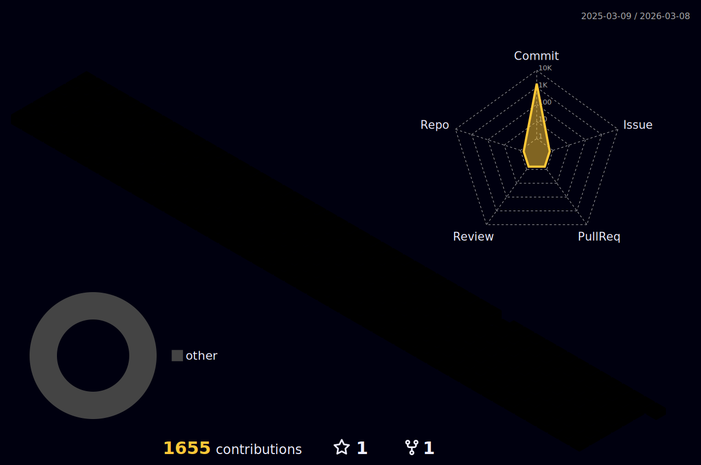

### Hi there

---
### 关于我

 

---

[//]: # (自述)
 
<li>

<strong>一名非科班学生，在重庆，以所掌握的绵薄知识量，去折腾一翻，喜欢对身边的事物深入探究原理。</strong></li>
  

[//]: # (Github账号详细参数)

    

[//]: # (GitHub统计数据)

    

[//]: # (合计贡献以及连续贡献记录)

    

[//]: # (最常用的语言)

    

[//]: # (Github资料奖杯)

  

[//]: # (活动数据折线图)

[//]: # (贪吃蛇活动图)

[//]: # (github 3d活动图)

## 社交网络
<table>
   <tr>
       <td  valign="top" width="50%">

### <a href="http://blog.sxlz.org/" target="_blank">博客</a>

<!-- START_SECTION:blog -->
* <a href='http://example.com/post/%E5%88%A9%E7%94%A8Microsoft%20azure%E6%90%AD%E5%BB%BA%E4%B8%80%E4%B8%AA%E7%A5%9E%E5%A5%87%E7%9A%84%E9%AD%94%E6%B3%95%E9%97%A8.html' target='_blank'>利用microsoft azure搭建一个神奇的魔法门</a> - 2022-08-26
* <a href='http://example.com/post/%E7%94%B3%E8%AF%B7%E5%BE%AE%E8%BD%AFE5%E5%BC%80%E5%8F%91%E8%80%85%E8%AE%A2%E9%98%85.html' target='_blank'>申请微软E5开发者订阅</a> - 2022-08-06
* <a href='http://example.com/post/github%E4%BB%93%E5%BA%93%E7%BB%91%E5%AE%9A%E8%87%AA%E5%AE%9A%E4%B9%89%E5%9F%9F%E5%90%8D.html' target='_blank'>github仓库绑定自定义域名/子域名</a> - 2022-07-20
* <a href='http://example.com/post/hexo-aurora-github%E6%90%AD%E5%BB%BA.html' target='_blank'>hexo+aurora+github搭建</a> - 2022-07-15
* <a href='http://example.com/post/%E6%AC%A2%E8%BF%8E%E6%9D%A5%E5%88%B0%E8%87%B4%E5%BD%A9%E4%B9%8B%E9%95%9C.html' target='_blank'>欢迎来到 致彩之镜</a> - 2022-07-15
* <a href='http://example.com/post/hello-world.html' target='_blank'>你好，世界！</a> - 2022-07-11
<!-- END_SECTION:blog -->
</td>
       <td  valign="top" width="50%">

###  <a href="https://www.douban.com/people/wxq888/" target="_blank">豆瓣</a>

<!-- START_SECTION:douban -->

<!-- END_SECTION:douban -->
</td>
</tr>
</table>
